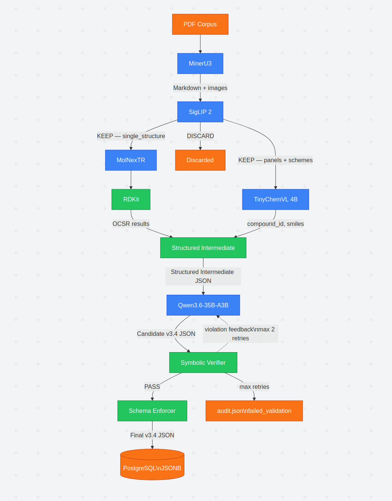

# chemical-extraction

PDF to JSON extraction. Extracts compounds, synthesis pathways, reaction conditions, and characterisation data from journal papers and their supporting information.

## Architecture



Five services: `mineru` · `vision` · `chemvlm` · `llm` · `orchestrator`. Can run via Docker Compose or directly as local processes.

---

## Prerequisites

- NVIDIA GPU(s) with CUDA 12+
- `uv` (Python package manager)
- HuggingFace account with access to Qwen models
- **Docker mode only:** Docker ≥ 24 with [nvidia-container-toolkit](https://docs.nvidia.com/datacenter/cloud-native/container-toolkit/install-guide.html)

---

## Deploy

### Docker mode

```bash
git clone https://github.com/K3r7d/chemical-extraction.git && cd chemical-extraction

bash scripts/deploy.sh
# or: make deploy
```

Paper data is downloaded automatically on first run. Subsequent starts skip the download.

### Local mode (no Docker)

Use this when Docker is unavailable (e.g. vast.ai, WSL, unprivileged containers).

```bash
git clone https://github.com/K3r7d/chemical-extraction.git && cd chemical-extraction
uv sync

bash scripts/deploy.sh --local
# or: make deploy-local
```

Services start as background processes on localhost. Logs are written to `logs/`.

To stop all local services:

```bash
bash scripts/stop_local.sh
# or: make stop-local
```

### Extract papers

```bash
# Docker mode
bash scripts/extract_all.sh             # all papers
bash scripts/extract_one.sh 1           # single paper

# Local mode
bash scripts/extract_all.sh --local
bash scripts/extract_one.sh 1 --local

bash scripts/status.sh                  # health + results summary
```

Output written to `./outputs/<paper-slug>/extraction.json` and `audit.json`.

### Port assignments

| Service | Docker | Local |
|---|---|---|
| LLM (vLLM) | 8000 | 8000 |
| MinerU | 8000 (internal) | 8010 |
| Vision | 8001 | 8001 |
| ChemVLM | 8002 | 8002 |
| Orchestrator | 8080 | 8080 |

### GPU assignment

MinerU, Vision (SigLIP 2 + MolNexTR), and ChemVLM (TinyChemVL) are lightweight and share a single GPU (default: GPU 0). The LLM service automatically uses all remaining GPUs with tensor-parallel — no configuration needed.

---

## Local development

### Setup

```bash
uv sync          # install Python deps into .venv
make data        # download paper corpus
make models      # download MinerU pipeline weights (~1.2 GB, one-time)
make test        # 100 unit + integration tests (no GPU, no network)
```

### Running a subset of services (Docker)

```bash
# Start only the services you need
docker compose up -d mineru vision llm

# Override the LLM model without editing the compose file
LLM_MODEL_NAME=Qwen/Qwen2.5-7B-Instruct \
TENSOR_PARALLEL_SIZE=1 \
  docker compose up -d llm
```

### Overriding config (local mode)

All settings can be overridden via environment variables:

```bash
LLM_MODEL_NAME=Qwen/Qwen2.5-7B-Instruct bash scripts/deploy.sh --local
```

---

## Output format

```
outputs/
  cleaned/                    # preprocessed markdown (headers, refs, noise stripped)
    <n>/<paper-slug>/auto/<slug>.md
  mineru/                     # raw MinerU markdown + extracted figure images
    <n>/<paper-slug>/auto/
      <slug>.md
      images/*.jpg
  <paper-slug>/               # extraction results
    extraction.json           # v3.4 schema output
    audit.json                # retries, extraction_status, validation issues
logs/                         # local mode service logs
  llm.log  mineru.log  vision.log  chemvlm.log  orchestrator.log
```

### `extraction.json` top-level keys

| Key | Description |
|---|---|
| `extraction` | metadata: model, prompt version, date, status |
| `paper` | bibliographic info |
| `compounds` | list of compounds with id, name, SMILES, formula, role |
| `synthesis` | list of pathways: target, steps, conditions, yields |

### `audit.json`

```json
{
  "retries": 0,
  "extraction_status": "ok",
  "issues": [
    {"code": "MS_ARITHMETIC", "severity": "warning", "message": "...", "path": "..."}
  ]
}
```

`extraction_status` is `"ok"` or `"failed_validation"` (errors remain after 2 retries).

---

## Running tests

```bash
make test                  # unit + integration (no GPU, no network required)
uv run pytest -m docker    # smoke tests against a running Docker stack
uv run pytest -m slow      # real SigLIP 2 triage on paper 1 (requires MinerU output)
```

---

## Adding a new paper

Drop one or two PDFs into `data/papers/<n>/`:
- Main paper: any filename not containing `_si_` or `supporting`
- SI: filename must contain `_si_` or `supporting` (case-insensitive)

Then run:
```bash
bash scripts/extract_one.sh <n>           # Docker
bash scripts/extract_one.sh <n> --local   # Local
```
